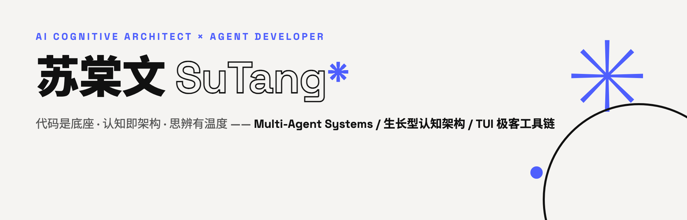

  

---

### `01 /` 关于我

AI 开发者，Base 北京。

- 多智能体系统与社会学仿真 — Agent 协作、博弈与群体行为演化
- 生长型认知架构与动态知识图谱 — 网状演化的知识生态，上下文压缩与本地化认知工作空间
- TUI / CLI 极客工具链 — 轻量、高性能的终端开发者工具

---

### `02 /` 技术栈

| 维度 | 技术选型 |
| --- | --- |
| **后端与系统** | `Node.js` · `TypeScript` · `Fastify` · `SQLite` |
| **Agent 与认知** | 多智能体协作框架 · 动态知识图谱 · Context 压缩与管理 |
| **交互与前端** | `TUI / CLI` · 极简 Web 界面 |
| **开发环境** | `Linux / NixOS` · 自动化工作流 |

---

### `03 /` 贡献动态

  

<!-- profile readme trigger -->
