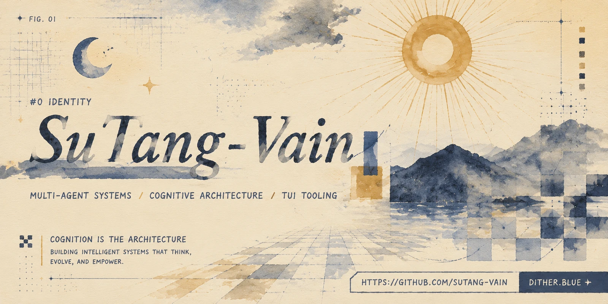

  

---

### `#1` About `// ABOUT`

 Hey, I'm an AI developer tinkering with new interaction paradigms.
 Currently obsessed with three things:
>  * **Generative Visuals & UI**: Crafting warm, dynamic web interfaces powered by AI.
>  * **Multi-Agent Simulation**: Watching groups of agents team up, negotiate, and evolve.
>  * **Context Governance**: Pushing the limits of LLM memory and context scheduling.
> 

---

### `#2` Tech Stack `// STACK`

* **Languages & Core**: `TypeScript` · `Node.js` · `Python` · `Fastify` · `SQLite`
* **Frontend & Visuals**: Generative UI · `React` · `Vue` · `TUI / CLI`
* **Agent & Context**: Multi-Agent Systems · Context Governance · Knowledge Graphs

---

### `#3` Stats `// STATS`

  
  

---

### `#4` Activity `// ACTIVITY`

  

  ▚▚ EOF — SUTANG-VAIN ▞▞

